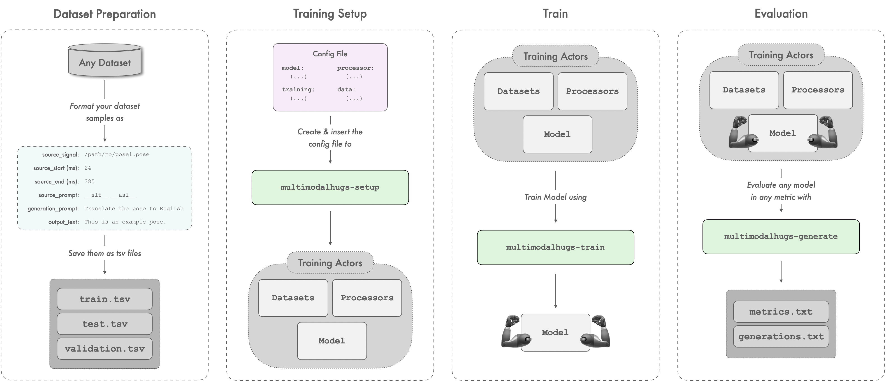

<div align="center">
  <h1>🎨 MultiModalHugs</h1>
</div>

**MultimodalHugs** is a lightweight, modular framework built on top of [Hugging Face](https://huggingface.co/) for training, evaluating, and deploying **multimodal AI models** with minimal code.

It supports diverse input modalities—including text, images, video, and pose sequences—and integrates seamlessly with the Hugging Face ecosystem (Trainer API, model hub, `evaluate`, etc.).

---

## Key Features

- ✅ **Minimal boilerplate**: Standardized TSV format for datasets and YAML-based configuration.
- 🔁 **Reproducible pipelines**: Consistent setup for training, evaluation, and inference.
- 🔌 **Modular design**: Easily extend or swap models, processors, and modalities.
- 📦 **Hugging Face native**: Built to work out-of-the-box with existing models and tools.
- **Examples Included**: Refer to the `examples/` directory for guided scripts, configurations, and best practices.
  
Whether you're working on sign language translation, image-to-text, or token-free language modeling, MultimodalHugs simplifies experimentation while keeping your codebase clean.

For more details, refer to the [documentation](docs/README.md).

---

## Installation

1. **Clone the repository**:

   ```bash
   git clone https://github.com/GerrySant/multimodalhugs.git
   ```

2. **Navigate and install the package**:

   - **Full installation** (all modalities — recommended for most users):
      ```bash
       cd multimodalhugs
       pip install ".[full]"
      ```
   - **Modality-specific installation** (install only what you need):
      ```bash
       pip install ".[pose]"         # pose sequences (pose-format)
       pip install ".[video]"        # video (av, torchvision, opencv-python)
       pip install ".[signwriting]"  # SignWriting (signwriting)
       pip install ".[image]"        # images (opencv-python)
       pip install ".[pose,video]"   # combine multiple modalities
      ```
   - **Developer installation**:
      ```bash
       cd multimodalhugs
       pip install -e ".[full,dev]"
      ```

## Usage

### 🚀 Getting Started

To set up, train, and evaluate a model, follow these steps:



### 1. Dataset Preparation

For each partition (train, val, test), create a TSV file that captures essential sample details for consistency.

#### Metadata File Requirements

The `metadata.tsv` files for each partition must include the following fields:

- `signal`: The primary input to the model, either as raw text or a file path pointing to a multimodal resource (e.g., an image, pose sequence, or audio file).
- `signal_start`: Start timestamp (commonly in milliseconds) of the input segment. Can be left empty or `0` if not required by the setup.
- `signal_end`: End timestamp (commonly in milliseconds) of the input segment. Can be left empty or `0` if not required by the setup.
- `encoder_prompt`: An optional text field providing additional context to the input; this may include instructions (e.g., `Translate the pose to English`), modality tags (e.g., `__asl__` for American Sign Languge, ASL), or any text relevant to the task.
- `decoder_prompt`: An optional textual prompt used during decoding to guide the model’s output generation, corresponding to Hugging Face’s `decoder_input_ids`.
- `output`: The expected textual output corresponding to the input signal.


### 2. Setup Datasets, Model, and Processors

```bash
multimodalhugs-setup --modality {pose2text,signwriting2text,image2text,etc} --config_path $CONFIG_PATH --output_dir $OUTPUT_PATH
```

### 3. Train a Model

```bash
multimodalhugs-train --task <task_name> --config_path $CONFIG_PATH --output_dir $OUTPUT_PATH
```

### 4. Generate Outputs with a Trained Model

```bash
multimodalhugs-generate --task <task_name> \
      --metric_name $METRIC_NAME \
      --config_path $CONFIG_PATH \
      --model_name_or_path $CKPT_PATH \
      --processor_name_or_path $PROCESSOR_PATH \
      --dataset_dir $DATASET_PATH \
      --output_dir $GENERATION_OUTPUT_DIR
```


For more details, refer to the [CLI documentation](docs/general/CLI.md).

[Here](/examples/multimodal_translation/) you can find some sample end-to-end experimentation pipelines.

## Directory Overview

```yaml
multimodalhugs/
├── README.md               # Project overview
├── LICENSE                 # License information
├── pyproject.toml          # Package dependencies and setup
├── .gitignore              # Git ignore rules
├── .github/                # GitHub actions and workflows
│   └── workflows/
├── docs/                   # Documentation
│   ├── README.md
│   ├── customization/      # Guides for custom extensions
│   ├── data/               # Data configs and dataset docs
│   ├── general/            # General framework documentation
│   ├── media/              # Visual guides
│   └── models/             # Model documentation
├── examples/               # Example scripts and configurations
│   └── multimodal_translation/
│       ├── image2text_translation/
│       ├── pose2text_translation/
│       └── signwriting2text_translation/
├── multimodalhugs/         # Core framework
│   ├── custom_datasets/    # Custom datasets
│   ├── data/               # Data handling utilities
│   ├── models/             # Model implementations
│   ├── modules/            # Custom components (adapters, embeddings, etc.)
│   ├── processors/         # Preprocessing modules
│   ├── tasks/              # Task-specific logic (e.g., translation)
│   ├── training_setup/     # Training pipeline setup
│   ├── multimodalhugs_cli/ # Command-line interface for training/inference
│   └── utils/              # Helper functions
├── scripts/                # Utility scripts (e.g., docs generation, metrics)
└── tests/                  # Unit and integration tests

```

For a detailed breakdown of each directory, see [docs/README.md](docs/README.md).

## Contributing

All contributions—bug reports, feature requests, or pull requests—are welcome. Please see our [GitHub repository](https://github.com/GerrySant/multimodalhugs) to get involved.

## License

This project is licensed under the terms of the MIT License.

## Citing this Work

If you use MultimodalHugs in your research or applications, please cite:

```bibtex
@misc{sant2025multimodalhugs,
  title        = {MultimodalHugs: Enabling Sign Language Processing in Hugging Face},
  author       = {Sant, Gerard and Jiang, Zifan and Escolano, Carlos and Moryossef, Amit and Müller, Mathias and Sennrich, Rico and Ebling, Sarah},
  year         = {2024},
  note         = {Manuscript submitted for publication},
  howpublished = {https://github.com/GerrySant/multimodalhugs},
}
```