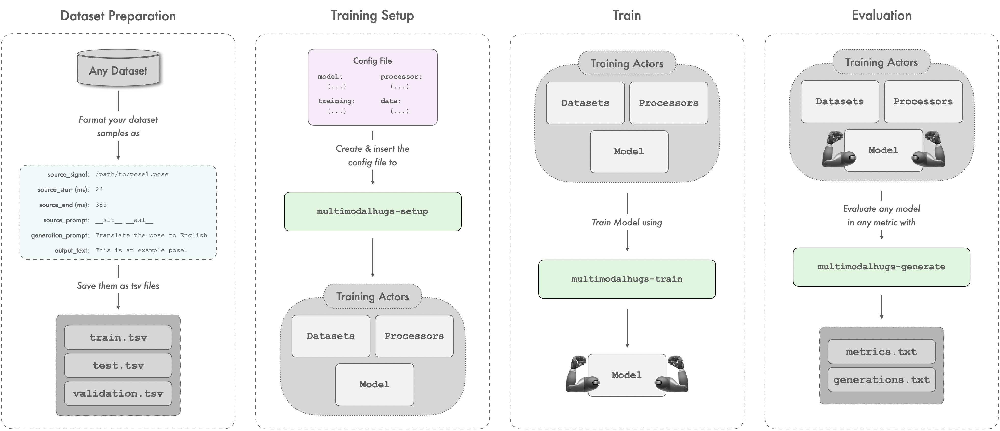

# MultiModalHugs Documentation

## 📂 Directory Structure

The MultiModalHugs documentation is organized into the following sections:

### **1. Data Documentation (`docs/data/`):**
Contains configuration files and dataset specifications.

- **dataconfigs/**
  - [`BilingualImage2textMTDataConfig`](data/dataconfigs/BilingualImage2textMTDataConfig.md)
  - [`MultimodalDataConfig`](data/dataconfigs/MultimodalDataConfig.md)
  - [`Pose2TextDataConfig`](data/dataconfigs/Pose2TextDataConfig.md)
  - [`PreprocessArguments`](data/dataconfigs/others/PreprocessArguments.md)

- **datasets/**
  - [`BilingualImage2TextDataset`](data/datasets/BilingualImage2TextDataset.md)
  - [`BilingualText2TextDataset`](data/datasets/BilingualText2TextDataset.md)
  - [`Pose2TextDataset`](data/datasets/Pose2TextDataset.md)
  - [`SignWritingDataset`](data/datasets/SignWritingDataset.md)

### **2. General Documentation (`docs/general/`):**
Contains documentation for core configurations and CLI usage.

- [`CLI.md`](general/CLI.md): Detailed guide for using the MultiModalHugs CLI.
- [`configuration.md`](general/configuration.md): Explanation of configuration file parameters.

### **3. Model Documentation (`docs/models/`):**
Includes specifications for model architectures used in MultiModalHugs.

- **models/**
  - [`MultiModalEmbedderConfig`](models/multimodal_embedder/MultiModalEmbedderConfig.md)
  - [`MultiModalEmbedderModel`](models/multimodal_embedder/MultiModalEmbedderModel.md)

## 🚀 Getting Started
To set up, train and evaluate a model, follow these steps:



## 1. Dataset Preparation
For each partition (train, val, test), create a TSV file that captures essential sample details for consistency. 

#### Metadata File Requirements

The `metadata.tsv` files for each partition must include the following fields:

- `signal`: The primary input to the model, either as raw text or a file path pointing to a multimodal resource (e.g., an image, pose sequence, or audio file).
- `signal_start`: Start timestamp (commonly in milliseconds) of the input segment. Can be left empty or `0` if not required by the setup.
- `signal_end`: End timestamp (commonly in milliseconds) of the input segment. Can be left empty or `0` if not required by the setup.
- `encoder_prompt`: An optional text field providing additional context to the input; this may include instructions (e.g., `Translate the pose to English`), modality tags (e.g., `__asl__` for American Sign Languge, ASL), or any text relevant to the task.
- `decoder_prompt`: An optional textual prompt used during decoding to guide the model’s output generation, corresponding to Hugging Face’s `decoder_input_ids`.
- `output`: The expected textual output corresponding to the input signal.

> **Note:** If using a pretrained model, ensure you understand how the model expects the `decoder_prompt`. Some models, such as T5, automatically assume this prompt is always the `<pad>` token and prepend it by default. Therefore, explicitly specifying `<pad>`in this field is unnecessary and would result in unexpected behaviour.

## 2. Setup Datasets, Model and Processors:
   ```bash
   multimodalhugs-setup --modality {pose2text,signwriting2text,image2text} --config_path CONFIG_PATH
   ```

## 3. Train a model:
   ```bash
   multimodalhugs-train --task <task_name> --config_path CONFIG_PATH
   ```

## 4. Generate outputs with a trained model:
   ```bash
   multimodalhugs-generate --task <task_name> \
        --metric_name METRIC_NAME \
        --config_path CONFIG_PATH \
        --model_name_or_path MODEL_PATH \
        --processor_name_or_path PROCESSOR_PATH \
        --dataset_dir DATASET_PATH \
        --output_dir OUTPUT_DIR
   ```

> **Note:** For more detailed information on each command, refer to the <a href="general/CLI.md">CLI documentation</a>.

## 📁 Examples

To see concrete examples of dataset configurations and usage for different modalities, check out the [`examples/`](examples/) directory.

## 📖 Additional Resources

- Hugging Face `Trainer` API: [TrainingArguments Documentation](https://huggingface.co/docs/transformers/main_classes/trainer#transformers.TrainingArguments)
- MultiModalHugs Repository: (Include link if available)

---

If you have any questions or suggestions, feel free to contribute or raise an issue!
