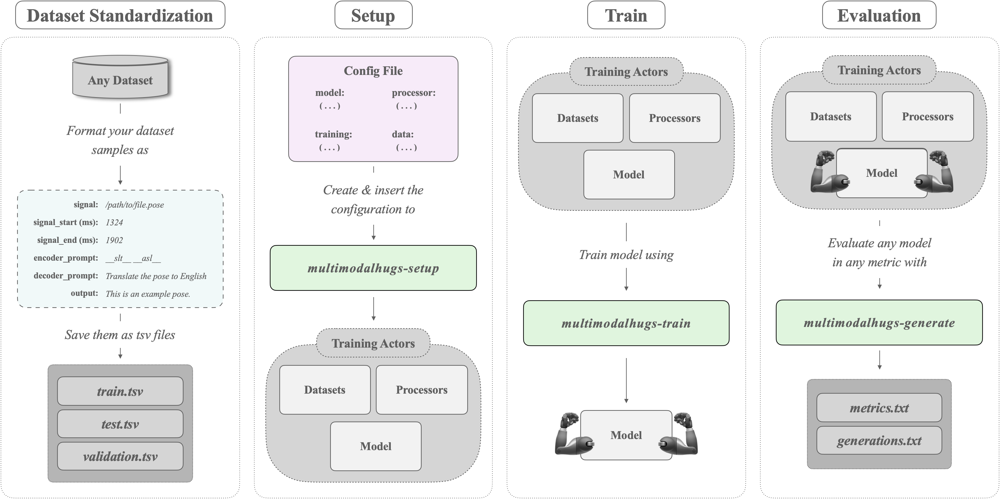

# MultiModalHugs Documentation

## 📂 Directory Structure

The MultiModalHugs documentation is organized into the following sections:

### **1. Data Documentation (`docs/data/`):**
Contains configuration files and dataset specifications.

- **dataconfigs/**
  - [`BilingualImage2textMTDataConfig`](data/dataconfigs/BilingualImage2textMTDataConfig.md)
  - [`MultimodalMTDataConfig`](data/dataconfigs/MultimodalMTDataConfig.md)
  - [`Pose2TextDataConfig`](data/dataconfigs/Pose2TextDataConfig.md)
  - [`PreprocessArguments`](data/dataconfigs/others/PreprocessArguments.md)

- **datasets/**
  - [`BilingualImage2TextDataset`](data/datasets/BilingualImage2TextDataset.md)
  - [`BilingualText2TextDataset`](data/datasets/BilingualText2TextDataset.md)
  - [`Pose2TextDataset`](data/datasets/Pose2TextDataset.md)
  - [`SignWritingDataset`](data/datasets/SignWritingDataset.md)

### **2. General Documentation (`docs/general/`):**
Contains documentation for core configurations and CLI usage.

- [`CLI.md`](general/CLI.md): Detailed guide for using the MultiModalHugs CLI.
- [`configuration.md`](general/configuration.md): Explanation of configuration file parameters.

### **3. Model Documentation (`docs/models/`):**
Includes specifications for model architectures used in MultiModalHugs.

- **models/**
  - [`MultiModalEmbedderConfig`](models/multimodal_embedder/MultiModalEmbedderConfig.md)
  - [`MultiModalEmbedderModel`](models/multimodal_embedder/MultiModalEmbedderModel.md)

## 🚀 Getting Started
To set up, train and evaluate a model, follow these steps:



## 1. Dataset Preparation
For each partition (train, val, test), create a TSV file that captures essential sample details (input paths, timestamps, prompts, target texts) for consistency. 

#### Metadata File Requirements

The `metadata.tsv` files for each partition must include the following fields:

- `source_signal`: The source text for the translation from which the images will be created / The path of the images to be uploaded (currently with support for `.jpg`, `.jpeg`, `.png`, `.bmp`, `.tiff`, `.tif`, `.npy`)
- `source_start`: Start timestamp (commonly in milliseconds) of the input segment. Can be left empty or `0` if not required by the setup.
- `source_end`: End timestamp (commonly in milliseconds) of the input segment. Can be left empty or `0` if not required by the setup.
- `source_prompt`: A text string (e.g., `__vhe__`) that helps the model distinguish the source language or modality. Can be empty if not used.
- `generation_prompt`: A text prompt appended during decoding to guide the model’s generation. Useful for specifying style or language; can be empty if not used.
- `output_text`: The target text for translation.

## 2. Setup Datasets, Model and Processors:
   ```bash
   multimodalhugs-setup --modality {pose2text,signwriting2text,image2text} --config_path CONFIG_PATH
   ```

## 3. Train a model:
   ```bash
   multimodalhugs-train --task translation --config_path CONFIG_PATH
   ```

## 4. Generate outputs with a trained model:
   ```bash
   multimodalhugs-generate --task translation --config_path CONFIG_PATH --model_name_or_path MODEL_PATH --processor_name_or_path PROCESSOR_PATH --dataset_dir DATASET_PATH --output_dir OUTPUT_DIR
   ```

<div class="note">
  <b>Note:</b> For more detailed information on each command, refer to the <a href="general/CLI.md">CLI documentation</a>.
</div>

## 📁 Examples

To see concrete examples of dataset configurations and usage for different modalities, check out the [`examples/`](examples/) directory.

## 📖 Additional Resources

- Hugging Face `Trainer` API: [TrainingArguments Documentation](https://huggingface.co/docs/transformers/main_classes/trainer#transformers.TrainingArguments)
- MultiModalHugs Repository: (Include link if available)

---

If you have any questions or suggestions, feel free to contribute or raise an issue!
